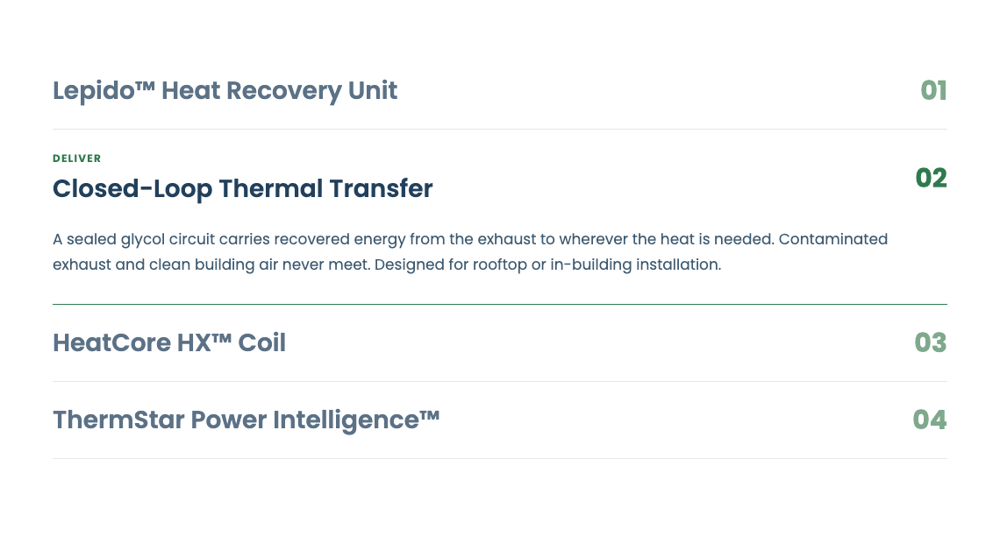

# Numbered Accordion for Elementor

A modern, lightly animated numbered accordion widget for Elementor.

Each row shows a title on the left and a sequence number on the right. Opening a
row reveals an optional eyebrow label and a description, and draws an accent rule
along the bottom of the row.



## Install

Download the latest zip from [Releases](../../releases), then in WordPress:
**Plugins → Add New → Upload Plugin**.

Once installed, the plugin checks this repository for new releases and shows a
normal update notice in wp-admin. Auto-updates are deliberately disabled —
installing an update is always a manual click.

## Requirements

- WordPress 6.0+
- PHP 7.4+
- Elementor 3.5+ (works on both classic and V4 Atomic pages)

## Notes for future maintenance

This is a classic (V3) `Widget_Base` widget, chosen deliberately: Elementor has
not published a public API for V4 atomic widgets, and its
`Elementor\Modules\AtomicWidgets\*` internals carry no deprecation policy. A V3
widget renders correctly on V4 Atomic pages and can sit alongside atomic
elements.

Do **not** test for `\Elementor\Widget_Base` at `plugins_loaded` — Elementor's
autoloader cannot resolve it (it derives `ELEMENTOR_PATH/widget-base.php`, while
the file lives at `includes/base/widget-base.php`), so the class does not exist
until the widgets manager requires it immediately before the
`elementor/widgets/register` hook fires.

## Releasing

```sh
bin/release.sh 1.0.2
```

Bumps the version in the plugin header, `NACC_VERSION` and `readme.txt`, builds
the zip, tags, and publishes a GitHub release with the zip attached. Client sites
see the update within 12 hours, or immediately via **Dashboard → Updates → Check
again**.

## Licence

GPL-2.0-or-later. Bundles
[plugin-update-checker](https://github.com/YahnisElsts/plugin-update-checker)
(MIT).
