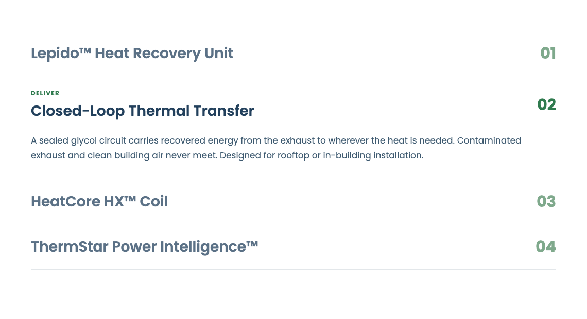

# Eruda Toolkit

A small toolkit of site-building modules. Each one can be switched off from
**Settings → Eruda Toolkit**; they are on by default.

| Module | What it does | Needs |
| --- | --- | --- |
| Numbered Accordion | A numbered, lightly animated accordion widget for Elementor | Elementor 3.5+ |
| Impact Grid | A grid of numbered figure and checklist cards that animate into view | Elementor 3.5+ |
| Split Slab and Ledger | A two-panel slab divided by a coloured bar, and a row-per-point comparison ledger | Elementor 3.5+ |
| Data Table | A reference table of two or three columns with a filled header row, banded rows and a last column you can set apart; folds into labelled blocks on a phone | Elementor 3.5+ |
| Process Steps | A numbered process read downwards, words left and a small object standing in space on the right; scrolling turns the objects rather than fading them in | Elementor 3.5+ |
| Image Compare | Two pictures in one frame with a divider you drag across to swap between them | Elementor 3.5+ |
| Flow Schematic | A process diagram — stages, connectors, a return path, a monitoring bar and a boundary — drawn in CSS so the labels stay text | Elementor 3.5+ |
| Industry Showcase | A list of industries walked by scrolling: names on the left, the words on the right, and a picture that dissolves as it changes, or is eaten by a sweeping grid of blocks | Elementor 3.5+ |
| Page Transitions | A curtain of columns that sweeps between pages, and a logo-and-progress preloader on the first page of a visit | Nothing beyond core |
| Duplicate Pages | A Duplicate row action and bulk action on Pages and Posts | Nothing beyond core |



## Install

Download the latest zip from [Releases](../../releases), then in WordPress:
**Plugins → Add New → Upload Plugin**.

Once installed, the plugin checks this repository for new releases and shows a
normal update notice in wp-admin. Auto-updates are deliberately disabled —
installing an update is always a manual click.

## Requirements

- WordPress 6.0+
- PHP 7.4+
- Elementor 3.5+, for the accordion and impact grid modules only

## Layout

```
numbered-accordion-elementor.php   bootstrap, update channel
includes/                          module registry, settings screen, and what every widget module shares
modules/accordion/                 the accordion widget and its assets
modules/impact/                    the impact grid widget and its assets
modules/motion/                    the text animation controls and assets
modules/story/                     the Scroll Story widget and its assets
modules/rail/                      the Scroll Rail widget and its assets
modules/header/                    the Mega Header widget and its assets
modules/table/                     the Data Table widget and its stylesheet
modules/steps/                     the Process Steps widget, its stylesheet and its script
modules/badge/                     the Eruda Spin extension and its assets
modules/explainer/                 the Split Slab and Comparison Ledger widgets
modules/schematic/                 the Flow Schematic widget
modules/compare/                   the Image Compare widget and its assets
modules/smoothscroll/              eases the whole page's scrolling
modules/industry/                  the Industry Showcase widget and its assets
modules/transitions/               the page transition curtain and the preloader
modules/partners/                  the Partner Diagram widget, its assets and bundled logos
modules/logotabs/                  the Customer Logo Tabs widget, its assets and the page 24 logos
modules/anatomy/                   the Case Anatomy widget, its assets and the three case logos
modules/casestudies/               the Case Studies post type, its ACF form and the Case Studies widget
modules/docshelf/                  the Documents post type, its ACF form and the Document Shelf widget
modules/news/                      news fields on Posts and the News Grid, Carousel, Press Quotes and Post Source widgets
modules/journey/                   the Journey Timeline widget
modules/chain/                     the Company Chain widget
modules/awards/                    the Award Wall widget and the eight award badges
modules/elements/                  Element List and Annotated Mark, two linked widgets, and the mark
modules/process/                   the Process Stepper widget
modules/assess/                    the Assessment Form widget, its REST route and the Assessments list
modules/duplicator/                the Duplicate action
tests/                             php tests/run.php
docs/QA.md                         manual checklist for what the tests cannot cover
```

A module implements `ErudaToolkit\Module`: static `id()`, `label()`,
`description()` and `requirements_met()`, plus a `boot()` that adds its hooks.
Register it in `Toolkit::$registry` and it appears on the settings screen. A
module id must never change once shipped — it is the settings option key.

`Toolkit::is_enabled()` treats a missing key as enabled, so a new module ships
switched on without an upgrade routine to write its key into the stored option.

**Partner Diagram (`modules/partners/`).** Three cards joined by arrows — a
supplier, the system, the facility — with two partners hung off the middle one
by a dashed bracket, over a blurred photograph. Built for the Trusted
Organizations section of ThermStar's page 24, and its defaults are that page's
approved wording and logos, bundled in `assets/img/`, so a freshly dropped
widget is already right. The five cards are named slots rather than a repeater,
because the layout has five places and a sixth card would have nowhere to go.

The motion is three classes, and the diagram reads correctly without each.
`.epdg--armed` is added by the script and is the only thing that hides
anything, so a page whose script never loads shows the whole diagram.
`.is-in` runs the entrance: cards rise in turn, then the arrows and the bracket
draw in. `.is-live` runs the heat pulse only while the diagram is on screen.
The entrance uses animations with backwards fill rather than transitions, so a
finished card holds nothing and the hover lift can move it. Once the entrance
is over the script takes `--armed` off again, which drops every entrance rule.

Lines draw by unclipping (`clip-path: inset()`), not by scaling: a scaled
dashed border stretches its dashes on the way. Both keyframes are spelled out,
because `inset()` cannot interpolate to the implicit `none` and would jump
halfway through instead of drawing.

Hover and focus highlighting is pure CSS, with `:has()` on the root: the core
card lights both arrows and the whole bracket, a partner lights only its own
branch. Only a card with a link can take focus, because a focusable card that
does nothing is a tab stop that goes nowhere.

The bracket is navy at 35% by default rather than the wireframe's white,
because white dashes disappear over the pale half of the photograph.

`tests/browser/partners-probe.js` measures all of it in headless Chrome: the
stagger, the draw passing through a partial clip, the line's actual pixels, the
pulse moving, the hover, three widths, 360px without sideways scroll, and
reduced motion.

**Customer Logo Tabs (`modules/logotabs/`).** The customer wall from page 24:
audience tabs, segment chips under the open tab, and a wall of logo tiles. It
ships the page's whole customer base — 58 logos as WebP, 652KB in all, plus
three typeset wordmarks for the logos with no file yet — so a freshly dropped
widget is already the wireframe. Industrial opens first by default; that is the
client's one hard rule for it.

Elementor cannot nest a repeater, so tab › segment › logo is stored flat: a
repeater of tabs, and one repeater of logos in which each row names its tab by
position and its segment by label. A tab's chips are the segment labels its
logos use, in the order they first appear. A tab with one segment shows no
chips. A logo naming a tab that does not exist is dropped rather than shown
under the wrong audience.

Logos are sized by shape, not by file: `min(118, √(4000 × aspect), 58 × aspect)`
pixels wide, which holds the area steady so a square badge and a long wordmark
read as the same weight. The server knows the aspect for the bundled files (by
name) and for library images (from their metadata). For anything else — an
SVG, or an image from outside the library — it marks the image and the script
applies the same rule from the loaded picture.

Every panel is in the markup, hidden ones too, so all the logos are in the page
for search engines. The URL hash opens a tab (`#ind`, `#rest`, `#hosp`, or
whatever link name a tab is given), both on load and on `hashchange`; any other
hash, such as `#customers`, leaves the default alone. The tabs follow the
WAI-ARIA pattern: roving tabindex, and arrows, Home and End move and select at
once. Chips use `aria-pressed`. The tile fade is capped at 10 × 12ms of stagger
plus a 160ms fade, so a wall of any length is in within 300ms.

The tabs and chips are buttons, and Hello Elementor styles every button pink,
so their rules restate every property for every state. The fixture carries that
reset, and the probe checks it does not leak in.

`tests/browser/logotabs-probe.js` covers 44 checks: the defaults, the optical
sizes, filtering, the fade finishing inside 300ms, the keyboard, both kinds of
hash, the tab order, the script sizing an SVG, 1024/767/360px layouts (with the
chip row as the only thing that scrolls sideways), and reduced motion.

**Case Anatomy (`modules/anatomy/`).** The Evidence card on page 25: one logo
tab per project, and under it the same six questions answered in tiles — the
challenge, the source, where the heat goes, the solution, the period, the
result — with the result in navy. It ships CWS, Lantmännen and Bruzaholms with
every answer taken from their case PDFs, and a link to each PDF.

The six questions are shared and set once, at widget level; each project has
six fixed answer fields, because Elementor cannot nest a repeater. A missing
answer drops its tile, but the others keep their numbers: 04 is always the
solution. Projects are capped at four *after* empty rows are dropped, so a
blank row left in the repeater does not take a real project's tab.

The result number is the light green, not the wireframe's dark green, which
was about 2:1 on navy. The answers' entrance is 35ms apart and 120ms long, so
the sixth is in by 295ms. Tabs are the same WAI-ARIA pattern as Customer Logo
Tabs, with no hash support (nothing links to a case by hash).

`tests/browser/anatomy-probe.js` runs 41 checks, including the wireframe's
type, colours and sizes read back from the browser.

**Case Studies (`modules/casestudies/`).** The page 25 case study cards, run
from the dashboard. The module registers a **Case Studies** post type and a
**Sector** taxonomy, and defines the edit form as an ACF local field group in
code (`CaseStudies_Content::field_group()`), so the form is identical on every
install and cannot be broken from the ACF screens. The **Case Studies**
widget reads the published cases in their Order and prints the chips and
cards. Nothing is built from Loop Items or Loop Grids, and nothing is typed on
the page.

It learned from `1-plan/08-CASE-STUDIES-ACF-PLAN.md` but departs from it on
purpose. That plan had a card widget inside an Elementor Loop Item, a Loop
Grid, a Taxonomy Filter and five entries typed by hand. Here it is one widget
and a seeding script. The sector slugs, the field set, the content rules and
the Order numbers come from the plan.

- The widget reads **post meta**, not `get_field()`, so the cards keep showing
  if ACF is ever deactivated; only the form needs ACF. The module warns on the
  Case Studies screens when ACF is missing.
- The form enforces the content doc's rules. A published result needs a
  figure and its basis, both hidden and not required for an ongoing study.
  There is no money field. The sector is picked in the form (saved as the real
  term) and the taxonomy's own sidebar box is removed, so the two can't
  disagree.
- A published case without a figure is skipped instead of shown as a card
  claiming nothing, and the admin list says so in red. The list also shows
  photo, sector, what the card says, the link and the Order.
- No single pages and no archive (`publicly_queryable` false): cards link to
  their PDFs, and pages holding only a card's own words would be thin.
- Chips are the sectors the shown cards use, in card order, so an empty sector
  never gets a chip. "Estimate my site" goes to the form page with
  `?sector=<slug>`, and the slugs match the industry page URLs.
- The same widget serves the industry pages (one sector, chips off) and the
  home page (How many: 3).

`bin/seed-case-studies.php` loads the five cases from
`tests/browser/casestudies-data.php`, uploading photos, logos and PDFs once
and reusing them after. The confidential Pancake Factory study is left out.
The same data file drives the browser fixture, so the test and the site cannot
drift. `tests/browser/casestudies-probe.js` runs 43 checks.

**Document Shelf (`modules/docshelf/`).** The page 26 PDF library, run from the
dashboard since 2.64.0. The module registers a **Documents** post type
(`resource_document`) and a **Filter** taxonomy (`document_type`), and defines
the edit form as an ACF local field group in code
(`DocShelf_Content::field_group()`), the same pattern as Case Studies. The
**Document Shelf** widget prints the published documents, in their Order, as
type chips and cards, each with page 1 of its PDF rising out of a pale cover
area like a sheet of paper.

Until 2.64.0 the list was a repeater inside the widget. That meant every
placed shelf kept its own copy of the rows, frozen at the moment it was
dropped. The Resources page went on showing "Coming soon" after the files
were uploaded, because a plugin update never touches rows a page has already
saved. The list now lives in one place and every shelf reads it. Rows left in
an old widget's saved settings are ignored.

- A document links to its **uploaded PDF**, or to **any URL** (SharePoint,
  say, so the file can be updated there) which wins when filled. With
  neither, the card is a plain card marked "Coming soon", never a dead link.
  The download attribute only applies to an uploaded PDF; browsers ignore it
  across origins.
- The filter slugs are the hash keys: `#docs-perf` opens Performance evidence,
  on load and on hashchange. Chips are the filters that have documents, in
  document Order, labelled with the filter's own name, so renaming a chip is
  renaming the term under Documents → Filters.
- The card link is named title + "PDF" + meta + "opens in a new tab"; covers
  are decorative.
- The widget reads post meta, not `get_field()`, so the shelf survives ACF
  being switched off; only the form needs it.

`bin/seed-documents.php` loads the twelve page 26 documents from
`DocShelf_Content::default_docs()`, reusing PDFs already in the media library
and uploading each cover once from `assets/covers/` (rendered from page 1 of
each PDF at 110 dpi, ~600px WebP). The Pancake Factory study and the Scott
Preston onboarding form are never seeded, and a test holds that. The probe
runs 40 checks, the same 40 as before the switch, because the widget looks and
behaves exactly as it did.

**News (`modules/news/`).** Page 27 and everything that lists posts. News items
are WordPress's own **Posts**, by Robiu's choice: no post type is registered.
Categories are core categories (Insights, Updates, Media, each with its
content-doc H2 as the description), and topics are core tags. The module adds
the "News item" ACF form to posts (featured, audio file with its quote and
credit, source name and link, the required Related page, and a card layout
override) and four widgets. None uses Elementor's Loop Grid or Loop Carousel.

- **News Grid** (`enws-news-grid`): a plain grid of equal cards, 3 / 2 / 1
  across (Robiu asked for cards over the bento, 30 Sep 2026). The newest
  *featured* post leads the first page and is left out of later pages so it
  never shows twice; the rest follow newest first. Chips come from the
  categories that have posts; `#news-<slug>` opens one. On a category or tag
  archive the grid follows it. **Load more** asks
  `GET /wp-json/eruda/v1/news-grid` (public, read-only) for the next page, and
  the same `News_Render` prints both.
- **Podcast cards and the player.** A post is a podcast card when it has an
  audio file, *or* when its card is set to Podcast and it has a Source link.
  The second is how the BBC episode works: the MP3 is not ours to host, so the
  card links to the BBC's own page. Every podcast card has the player and a
  **"Listen on {source} ↗"** button to the episode page. With a file, the
  player plays in the page: a round play button, a waveform of two identical
  rows of bars with the lit row clipped to the progress, a real range input
  laid invisibly over it for clicks, drags and arrow keys, and the time. One
  plays at a time, and only metadata is fetched, once the player is near the
  screen. Without a file the same drawing is a link to the episode, so the card
  looks the same either way. Bar heights are seeded by the post id, so each
  post has its own waveform. The whole player can be replaced through the
  `eruda_news_audio_player` filter.
- **News Carousel** (`enws-news-carousel`): photo cards on a scroll-snap row,
  3.2 / 2.2 / 1.1 in view. Arrows are its own, or any two buttons in the same
  section with the classes `enws-car-prev` / `enws-car-next`, so they can sit
  beside a heading built with normal widgets.
- **Press Quotes** (`enws-press-quotes`): frosted cards for a dark section. A
  repeater is right here, because these quotes are fixed history.
- **Post Source Box** (`enws-post-source`): for the single template. It shows
  "Originally published by", the audio, and the Related page card.

`bin/seed-news.php` sets up the categories and topics, renames
Uncategorized to Insights (so it stays the default and never shows as a
chip), loads the four launch posts, and deletes "Hello world!". The two
norrelinc.com posts keep their own bodies and dates, with the H1 that
repeated the title removed. The Welcome post's two paragraphs, printed twice
in the original, are kept once, and its links to norrelinc's contact page
keep their words and lose the link until the linking pass. The probe runs 61
checks, including real playback, pausing and seeking in Chrome.

**Journey Timeline (`modules/journey/`) and Company Chain (`modules/chain/`).**
Two small, animated About-page widgets. Both are repeaters, which suits short,
fixed lists. Both use the Partner Diagram's three motion states: `--armed`
hides, `.is-in` plays, and the armed class comes off once the entrance is over.
Both skip the entrance in the editor, and both are static and final under
reduced motion.

- **Journey Timeline** (`ejny-journey-timeline`): years in circles down a line
  that fades from grey to green. Rows differ in height, so the line is the
  list's own `::before` (an `<ol>` may hold only `<li>`), and the script
  measures the first and last circle centres and writes them to `--ejny-top`
  and `--ejny-len`. It also inverts the line's easing curve,
  `cubic-bezier(.45,.05,.3,1)`, to find the moment the line reaches each
  circle, and gives that row its delay (`--ejny-at`). So each row lands as the
  line passes it, whatever the row heights. Each row's title and description
  are one tight flex block centred on the circle, which fixes the wireframe's
  last row, where grid row stretch pulled them apart. The current step fills
  green after the line arrives, and a second ring pulses from its halo.
- **Company Chain** (`echn-company-chain`): cards joined by arrows. In a row
  the cards use **subgrid** on the chain's four rows (logo, label, name,
  sub-line), so a label that wraps moves every name down together and the
  names stay on one line. It stacks when the *widget* is narrower than "Stack
  below" (default 520px), measured on the widget's parent by a
  ResizeObserver, since a half column stacks sooner than the screen does. It
  always stacks on phones, and the stacked rules are repeated under a phone
  media query for a page without the script. Stacked arrows rotate their
  drawing, not their box, so the entrance moves them downward.

Probes: `journey-probe.js` (40 checks: the line meets the centres at every
width and in a 320px column, each row lands as the line passes, the green fill
comes after the line, the pulse, hover, 56px phone circles) and
`chain-probe.js` (35: names aligned under a two-line label, the entrance order,
stacking by column width and by phone width, a phone with the script off, no
overflow at 1440/1100/767/360).

**Award Wall (`modules/awards/`).** The eight Lepido awards on page 28: a big
number beside a grid of badge cards, in an off-white panel. The number is the
count of awards listed, so adding one updates it, unless a number is typed.
`{years}` in the line becomes the earliest to latest year found, joined with
word joiners around the dash so it never breaks across two lines. The layout
follows the widget's own width through container queries: the number moves on
top below 900px, the grid goes to two columns below 640px, and badge areas
shrink below 400px. A dark badge gets a padded dark chip the size of the badge
itself, not a dark fill across the whole badge area (the wireframe's version
read heavier than the rest). The bundled Perpetuum badge is cropped from its
240px dark square to the artwork plus 14px, so the file is its own chip. The
number counts up once on scroll, from 0 on screen but with an aria-label
holding the real number, and the cards fade in 60ms apart. The probe runs 34
checks.

**Element List and Annotated Mark (`modules/elements/`).** The logo section on
page 28, "Four elements, one mission", as two widgets that can sit anywhere:
the list of Air, Fire, Water and Earth with their tinted icon tiles, and the
logo with a pill label per element joined by a leader line to a dot on the
part of the mark it describes. Pointing at, focusing or tapping an item in
either one lights the same key in every widget of the same link group (the
default is `logo-elements`). The widgets never look for each other: an item
announces `document` CustomEvent `eruda:link` with `{ group, key, source }`,
an empty key clears, and anything else on the page may listen or announce the
same way. Leaving, Esc, tapping the item again or tapping elsewhere clears it.
The mark fades what is not lit to .35; the list steps the lit row in and turns
its name green. Leader lines are drawn by the script in stage pixels from each
label's measured inner edge, level for 12.5% of the width, then to the dot,
redrawn on resize and once fonts load; without the script a percent estimate
stands in. Dot and label positions are sliders in percent of the 560×520
stage, so the defaults are the wireframe's. Below 420px of widget width the
labels shrink to 20px and the list's subtitle goes under the name. The mark
builds in once on scroll (logo, labels 120ms apart, lines drawn out of their
labels, dots pop). The list can step through the elements every 3s while on
screen, until anyone points at anything in the group. Neither moves for
visitors who ask for less motion, and linking still works for them. The mark
is `thermstar-icon.png` converted to WebP (148KB to 58KB). The mark fills its column; an optional Max width (`--eam-max`) caps it.
Both widgets stretch by default in a flex parent, through `:where()` rules
Elementor's own width settings override, because a container-query wrapper
has no width of its own and collapsed to nothing otherwise. The probe runs 76
checks, touch included.

**Process Stepper (`modules/process/`).** "How ThermStar works" on page 28, and
reusable on the Services pages: numbered stages on a rail, a green line filled
to the picked stage, and a panel under the rail whose caret sits under it.
Hover, focus, click and the arrow keys (roving tabindex, Home and End, wrapping
at the ends) pick a stage; stages before it are "done". The panel holds one
slide per stage rendered by PHP, so the script only toggles `hidden`, and it is
an `aria-live="polite"` region. A stage without a link shows a quieter fallback
button (default "Request an Assessment") so the card stays balanced, or none,
letting the text run the full width. The layout comes from the widget's own
width against two breakpoint settings (900 and 560 by default), written to
`data-mode`: `h` equal columns; `scroll` the same rail scrolling sideways
inside itself with snap, edge fades only where there is more to see, the picked
stage scrolled into view (never on hover, or the rail would slide the next
stage under the pointer) and the caret measured and clamped inside the card;
`v` a vertical stepper whose picked row opens in place, accordion style. The
breakpoints are settings, which container queries cannot read, so a one-line
inline script after the markup sets the mode before first paint and the main
script keeps it current. In `v` each row draws its own segment of the line,
from its circle to the next, which is exactly one row tall because circles are
pinned to the top of their row; so no measuring. Hover does not pick in `v`.
Optional auto-advance steps through while on screen and stops for good at the
first pointer or key. The entrance draws the line and lands the stages 70ms
apart. Reduced motion: nothing moves, the fill and caret jump. The probe runs
57 checks, including Hello Elementor's pink buttons and the no-script layout.

**Assessment Form (`modules/assess/`).** A three-step heat recovery request:
the exhaust (temperature, airflow and hours on sliders, days as chips), what
it carries and where the heat could go (industry, tappable chips), then
contact details. After sending, the visitor sees an indicative estimate:
dollars a year, MMBtu a year, tonnes of CO2 and operating hours, with the
assumptions spelled out under it (1.08 × CFM × (exhaust °F − 60), 40% to 60%
recovered, fuel at 80% efficiency, the widget's gas price per therm, space
heating alone counted for half the year; figures to two significant figures).
As a pop-up it is a native `<dialog>` placed once, in the footer template:
any link matching its trigger (default `.ts-assess a, a.ts-assess,
a[href$="#request"]`) opens it, and without script those links go where they
point. It can also sit inline on a page. Requests post to
`POST /wp-json/eruda/v1/assessment`, which reads the recipient, price and send
mode from the widget as saved in Elementor (never from the request, so the
route can't be aimed at another inbox), drops bots through a hidden field and
a three-second minimum, limits a connection to five requests an hour, saves
every request under **Assessments** in the dashboard (a private post type with
list columns and a read-only summary), and, in "send" mode, emails the team
(reply goes to the visitor) and the visitor (their estimate). "Save only"
mode is for staging. The probe fakes the server, so it never saves or sends,
and runs 34 checks: every step, errors from the browser and the server, a
network failure, keyboard, Escape and backdrop closing, phone full-screen and
the inline copy.

## Notes for future maintenance

### The plugin is named Eruda Toolkit; its folder is not

The directory and main file are still `numbered-accordion-elementor`. That is
deliberate, and should stay that way while any install remains on 1.0.x.

WordPress identifies a plugin by its path, and the bundled
plugin-update-checker keys its update channel on the same path. Renaming either
orphans every existing install — PUC cannot carry an install across a slug
change, so each site would need a manual install-the-new-then-remove-the-old, in
that order, with the accordion missing from live pages in between.

The text domain stays `numbered-accordion` for the same reason.

### Widgets register through a silent guard

`register_widgets()` is wrapped in `class_exists()` so a malformed widget
cannot take the editor down. The cost is that a widget class named wrongly
simply never appears, with no error anywhere. That has now shipped twice:
2.3.0, where the controls hook never matched, and 2.6.0, where a search and
replace left the module looking for `Story_Grid_Widget` while the file
declared `Scroll_Story_Widget`.

`tests/run.php` now reads the names out of the module sources and checks that
some file in that module's `widgets/` directory declares each one. The widget
files cannot be loaded in the test suite -- they extend Elementor's
`Widget_Base` -- so a static check is the most that is available, and it is
enough to catch a typo or a rename.

### Everything lives in one panel category

`includes/class-panel-category.php` registers an "Eruda Toolkit" section and
every widget returns its slug from `get_categories()`. Registered once from
`Toolkit::boot()` rather than per module, so three modules do not race to
create the same category. The slug is panel-only: Elementor saves a widget's
name in a layout, never its category, so changing it cannot affect a live page.

### Strings that must never change

Live client pages carry these inside saved Elementor JSON. Change one and
existing pages render empty:

- the widget names `nacc-numbered-accordion` and `eimp-impact-grid`
- every `.nacc*` and `.eimp*` CSS class
- every Elementor control ID
- every text animation preset value (`words-up`, `chars-cascade`, and the rest)

PHP namespaces, class names and asset handles are runtime-only and safe to rename.

### The accordion widget

This is a classic (V3) `Widget_Base` widget, chosen deliberately: Elementor has
not published a public API for V4 atomic widgets, and its
`Elementor\Modules\AtomicWidgets\*` internals carry no deprecation policy. A V3
widget renders correctly on V4 Atomic pages and can sit alongside atomic
elements.

Do **not** test for `\Elementor\Widget_Base` at `plugins_loaded` — Elementor's
autoloader cannot resolve it (it derives `ELEMENTOR_PATH/widget-base.php`, while
the file lives at `includes/base/widget-base.php`), so the class does not exist
until the widgets manager requires it immediately before the
`elementor/widgets/register` hook fires.

### The impact grid

Two decisions here are worth keeping.

**Reveals are CSS animations, not transitions.** Each card's delay comes from a
`--eimp-i` custom property, and the animation uses `animation-fill-mode:
backwards` so it holds its opening frame during that delay and then hands the
element back to its declared style. A transition with a `transition-delay` would
have done the same reveal, but the delay would then also apply to the hover
lift, which would stall by up to half a second on the last card. Animations do
not have that problem.

**`--eimp-i` is rewritten per batch.** The markup ships an index matching each
card's position in the grid, which is the right cascade when the whole grid
arrives at once. `IntersectionObserver` rewrites it for each batch of cards that
crosses the threshold together, so a card scrolling in alone later does not sit
waiting out five other cards' worth of delay before appearing.

Whether a figure counts up is decided once, in PHP, by
`Impact_Content::is_countable()`, and handed to the browser as a data attribute.
Anything that is not a plain number — a range, a trailing plus, a percentage —
is left exactly as typed rather than counted to a value the widget guessed at.
The count-up derives its thousands separators and decimal places from the string
the editor typed, not from the visitor's locale.

Stacking is one `top` value and nothing else. A card is `position: sticky` at
all times -- a sticky box with `auto` insets lays out exactly like a relative
one, so grid mode costs nothing -- and the Card layout control switches `top`
between `auto` and a calc of the card's index times the ledge. That declaration
has to land on the card, not the grid: the calc multiplies `--eimp-i`, which
only exists per card, so routing it through a custom property on the container
resolves the index once, to its fallback of zero, and pins every card at the
same height. It looks like it works until you scroll.

The icon width control sets `width`, not `max-width`. That is not a style
preference: `max-width` on a replaced element with `width: auto` can only shrink
it below its intrinsic size, so the control silently stopped responding above
the width of the file WordPress served, and the icon is requested at full size
for the same reason. `max-width: 100%` remains, but only to stop a large icon
overflowing a narrow card.

Elementor has no nested repeater, so a checklist card's nesting comes from its
text: one item per line, and a line opening with a dash, asterisk or bullet
nests under the item above it. `Impact_Content::parse_list()` owns that, and
promotes an orphan sub-bullet to a top-level item rather than dropping it — a
list that lost text would look like a bug in the widget.

### Text animations

Adds an **Eruda Text Animation** section to the **Style** tab of the Heading
and Text Editor widgets. Pick a preset and the widget's existing text animates
as it scrolls into view — nothing is retyped, and a page built before this
module shipped can use it without being rebuilt.

Eleven presets: fade in, words up, words fade, words build, scroll highlight,
characters cascade, characters flip, lines reveal, blur in, scale pop and slide
in.

Scroll Highlight is the only one tied to scroll *position* rather than played
on a trigger. The words sit dim and light up as the paragraph crosses the
middle of the screen, following the scrollbar in both directions. It is the
CSS-side equivalent of:

```js
gsap.to( split.words, {
  color: '#fff', stagger: 0.1,
  scrollTrigger: { trigger: '.text', start: 'top center', end: 'bottom center', scrub: true }
} );
```

Two differences worth knowing. It animates opacity rather than colour, so it
works against any text colour the widget already has instead of needing a
hard-coded one; "Dimmed to" sets how faint the unlit words are. And the scrub
band is the element's height *or 45% of the viewport, whichever is larger* — a
one-line heading is about forty pixels tall, and sweeping a whole sentence
across forty pixels of scroll is a flicker rather than a sweep. Tall paragraphs
are unaffected.

Because the scrollbar is its timeline, it ignores Duration, Stagger, Delay,
Easing and the trigger controls, and those are hidden rather than left sitting
there doing nothing.

Words Build is the standard word reveal, matching the GSAP recipe it is named
after:

```js
gsap.from( split.words, {
  opacity: 0, y: 15, stagger: 0.06, duration: 0.5, ease: 'power2.out'
} );
```

Every number there is a default here: Duration 500ms, Stagger 60ms, easing
"Natural" (which is `power2.out`, easeOutCubic), and a fixed 15px lift rather
than an em-relative one so it reads the same on a paragraph as on a headline.
Verified in Chrome: per-word delays come out `0s, 0.06s, 0.12s, 0.18s, 0.24s`
at `0.5s` each on `cubic-bezier(0.215, 0.61, 0.355, 1)`, from
`matrix(1, 0, 0, 1, 0, 15)`.

Those defaults now apply to every preset, not just this one. 800ms was slower
than the convention for text. Alongside them: duration,
stagger, delay, easing, how far into view it starts, and whether it replays
every time.

There is a **Replay animation** button in the editor. Elementor's button
control fires `elementor.channels.editor.trigger( 'eanm:replay', controlView )`
in the panel; `assets/js/editor.js` listens there and reaches into the preview
iframe to call `erudaMotion.replay()`, which text-animation.js exposes on the
preview window. Replaying disarms, resets, commits and re-arms before playing,
for the same reason the initial arming does: taking the finished state away
from an armed element animates it backwards.

Fade In and Words Fade also take a direction and a travel distance. Directions
are named for where the text comes **from** — "From the left" rather than "Fade
left", which never says which end it starts at. The presets read `--eanm-dx`
and `--eanm-dy` rather than hard-coding an axis, so one pair of rules serves
every direction.

Three things are worth knowing before changing any of it.

**Use the generic section hook, never the common one.** This is what 2.3.0 got
wrong, and it made the whole feature invisible. `elementor/element/common/…`
does not fire per widget: Elementor registers the common controls once, on a
shared `Widget_Common` stack whose `get_name()` is `'common'`, then merges them
into every widget. A widget-name guard on that hook matches nothing, and the
section is silently never added. `elementor/element/after_section_end` fires on
the real widget, so the guard works there; the section is added the first time
a permitted widget closes any section, and a per-element flag stops it being
added again.

**Never declare a transition in the same rule as the start state.** This is the
one that broke Fade In and Blur In through three releases. Those presets
animate the target element itself, which is already on the page and already
visible, so with a transition already live, "become invisible" *was* a
transition. The element animated into hiding and then reversed. The script now
applies the start state under `data-eanm-ready`, forces a reflow, and only then
sets `data-eanm-armed`, which is what the transition rules key off.

`tests/browser/` measures this. Reading the CSS will not catch it; sampling
opacity over time will.

**Commit the start state before flipping it.** A preset that splits nothing —
Fade In, Blur In — puts the transition on the target element itself, which
already exists in the HTML. Setting `data-eanm-ready` and `data-eanm-in` inside
one style recalculation means the browser only ever computes the finished
state: no transition runs and the text just appears. The script reads
`offsetWidth` between the two to force the recalculation. The split presets
were partly shielded by their spans being freshly inserted; that is luck, not
design, so the fix applies to all of them.

**Every `var()` needs a fallback.** A custom property that fails to resolve
makes the entire declaration invalid, so `transition-duration: var(--eanm-duration)`
silently becomes `0s` and the animation looks broken rather than mistuned.

**A scrubbed preset must switch the reveal transition off.** Every split word
carries a transition once armed, and on a scrubbed preset that transition eases
towards each scrolled value instead of tracking the scrollbar. It looks like the
scrub is lagging and stuttering. Measured while getting this wrong: `--eanm-p`
read `1.000` on every word while their opacities were still crawling through
`0.92, 0.86, 0.75, 0.59, 0.35`. `tests/browser/highlight.html` is the case that
shows it.

**It writes no markup.** Every value reaches the DOM through Elementor's own
`prefix_class` and `selectors`, which Elementor applies live in the editor as
well as on the front end. A render-time attribute would not work: the native
Heading has a `content_template()`, so in the editor it is rendered client-side
by Backbone and never goes through PHP. The animation would work on the live
page and be invisible exactly where you need to see it.

**The text survives the script.** The stylesheet hides nothing on its own —
every rule that makes something invisible is scoped to `[data-eanm-ready]`, and
only the script sets that. Script blocked, browser too old, Reduce Motion on:
the heading renders plainly and completely. Keep it that way. It is also why
enqueuing the stylesheet late costs nothing, and why the scroll threshold
clamps below 1.0 — an element taller than the viewport can never be fully
visible, and an animation that never fires would be the one way this module
could make content disappear.

**Two widgets only, by design.** A composite widget like an Icon Box raises a
question the feature has no good answer to: whether its title and description
are one staggered run or two. Everything downstream is widget-agnostic, and the
hook needs no per-widget anchor, so a site that wants the controls elsewhere
adds a name to the list and nothing else changes:

```php
// Offer the animation controls on the Button widget too.
add_filter(
	'eruda_motion_supported_widgets',
	function ( $widgets ) {
		$widgets[] = 'button';
		return $widgets;
	}
);
```

One fact is deliberately duplicated: which preset splits by word, character or
line is stated in `Motion_Presets::all()` and again as a `--eanm-split` custom
property in the stylesheet. The script reads the CSS copy; the PHP copy is for
the tests and for the lazy-enqueue check. Add a preset and you must add it in
both places.

### Scroll Story

A column of text items on the left, a pinned panel on the right that follows
whichever item you are reading. Each item carries its own eyebrow, heading,
description and media — an image or a video.

Modelled on the "Why Terminal" section of terminal-industries.com, rebuilt with
no libraries, and measured against it rather than eyeballed.

**The highlight is scrubbed, not triggered.** How far an item has travelled up
the screen decides how many of its characters are lit. Scroll down and the
sweep runs forward; scroll back up and it retreats. On the reference this is a
class added and removed per character by scroll position, and the asymmetry is
the point:

```css
.estry-c        { transition: color 400ms ease; }          /* going out: plain */
.estry-c.is-on  { animation: estry-sweep 500ms ease forwards; }  /* coming in */

@keyframes estry-sweep {
  0%   { color: <waiting>; }   /* light grey */
  30%  { color: <flash>;   }   /* the accent, for a fraction of a second */
  100% { color: <read>;    }   /* near-black */
}
```

The flash at 30% is the whole trick, and it belongs to arriving only. A
character going out simply transitions back, so reversing reads as an undo
rather than as a second animation. There is no fixed stagger between one
character and the next any more — your scroll speed *is* the stagger.

The band is two lines across the viewport: the sweep starts when an item's top
crosses the lower line and finishes when its bottom crosses the upper one, so a
tall item takes proportionally longer and both ends land on screen. Both lines
are controls.

Only the characters between the old lit count and the new one are touched, so a
scroll of a few pixels costs a handful of class changes rather than one per
character in the section.

**The travelling notch.** The panel's left edge is flush top and bottom and
cuts *inwards* across a band, with rounded corners and a diagonal run between
them. The band travels down as you scroll the section.

The proportions come from reading the reference's own clip path at a 30px
depth, then expressing them as ratios of the depth so any depth keeps the
shape:

```
arc radius    28.17 / 30 = 0.939
arc rise      14.80 / 30 = 0.4933    arc run   4.21 / 30 = 0.1405
diagonal rise 34.90 / 30 = 1.1633    diag run 21.58 / 30 = 0.7190
```

The two arc runs and the diagonal run add to exactly the depth; the rises add
to 2.15 x depth, which is one transition.

**The band does not sweep the whole edge.** On the reference it travels 40% of
the panel's height and is centred in what is left over — 66px of clearance at
each end of a 985px panel, measured at both extremes of its scroll. Letting it
run into the corners, which is what the first version did, turns a detail
travelling along an edge into a bite taken out of one. The travel is a control;
the clearance follows from it.

The path is generated in JavaScript rather than written as CSS, because a curve
in a clip path is in user units: `clip-path: path()` and an SVG `clipPath` with
`userSpaceOnUse` both need rebuilding whenever the panel resizes. A polygon in
percentages would scale on its own but cannot hold a fixed-radius curve.

`clip-path` and `border-radius` clip the same box, so a notched panel cannot
take a radius from CSS. It takes one from the path instead: all four corners
are arcs in the same `d`, and the band is kept between them rather than between
the corners, so a panel can have a notch and a 96px radius at once and the two
can never meet. A CSS border is clipped away for the same reason, so the
panel's border is a stroked copy of that path, drawn at twice the asked-for
width and clipped by it — which leaves exactly the asked-for width on the
inside of the edge, corners and notch included.

The band also never consumes all the room it has: one shoulder's worth is held
back so there is always a straight stretch of edge between the notch and each
corner. Without that, a generous radius or a long band puts the notch's first
contact exactly where the corner curve begins and the two read as one dent. On
the reference's own proportions the reserve changes nothing — it has room to
spare, which is how `tests/browser/story-probe.js` can still reproduce its
66.25 and 460.25 to the decimal.

**The notch's three numbers are declared on `.estry`, not on the frame.** Every
control writes to `{{WRAPPER}} .estry`, and a custom property declared on the
frame itself beats one inherited from an ancestor however specific that
ancestor's selector is. Declaring the defaults on `.estry__frame` silently
killed the notch depth, length and travel controls: they wrote a value the
frame then shadowed.

**The panel is centred on the screen, always.** Its sticky offset is derived
from its own height rather than set directly, so changing the panel height, the
column gap or the spacing between items cannot push it off centre. The old
"pin below" control is now a nudge on top of that, for a tall sticky header.

**Nothing ever fades out.** Slides stack, and a change raises the incoming one
above the rest with a rising z-index, so you are always looking at something
arriving over a solid picture. The first version cross-faded both ways at once,
which meant the panel's own background showed through the middle of every
change as a black flash. The outgoing slide keeps its picture and its place.

Four entrances, all direction-aware, so scrolling back up is the mirror of
scrolling down rather than a repeat of it:

| | |
|---|---|
| Reveal | a soft-edged sweep, both pictures visible through the feather — the default |
| Wipe | a hard edge travels with the scroll, over a picture already oversized and relaxing into place |
| Zoom | arrives oversized and out of focus, resolves as it lands |
| Push | slides in over the one below |
| Dissolve | a plain cross-fade |

Reveal is a mask three times the panel's height sliding across it, so only
`mask-position` animates — cheap, and unlike a gradient whose stops move, it
interpolates everywhere. Its stops are not free choices. The panel is one third
of the mask, so the settled window is the mask's last third and the hidden
window is its first: anything but solid across 66.7–100% leaves a permanent
veil over part of a picture that has finished arriving, and anything but clear
across 0–33.3% means the entrance starts already half visible. The first
attempt had the feather ending at 70% and left a band across the top of every
settled panel, subtle enough to pass a visual check and be caught only by
sampling the pixels — which the probe now does.

Because that edge is soft you see both pictures through it, which is what makes
the counter-move worth having: the picture being replaced eases back and away
while the new one arrives over it, so for the length of a change the panel has
two things moving at different speeds rather than one moving and one sitting
still. The drift is held at its end value during that, because dropping a
finished animation snaps the transform back and the snap is what it is there to
avoid.

Three layers do this, because one element cannot hold two transforms or two
clip paths: `.estry__slide` owns the entrance edge, `.estry__inner` owns the
parallax and the blur, and the media itself owns the slow drift. Putting the
drift on the same element as the parallax does not merely look wrong — a
running keyframe animation wins outright over a transitioned transform on the
same element, and swallows the parallax whole.

Media always fills the panel: `object-fit: cover`, with the focal point as a
control. `cover` scales a small picture up as happily as it crops a large one,
so no shape or size of image can leave the panel's background showing — being
overruled is the only real risk, and nearly every theme ships
`img { height: auto }` at a specificity a plugin stylesheet cannot beat. Width,
height, `object-fit` and `object-position` are therefore forced, and
`tests/browser/story.html` carries a deliberately hostile theme block so the
probe proves it: a 60×40 picture fills a 576×792 panel under
`width: auto; height: auto; object-fit: contain; max-height: 60%`.

**What was not copied:** their panel is a `<canvas>` playing a scroll-scrubbed
image sequence, which needs hundreds of exported frames and a decode pipeline.
This changes between one image or video per item instead — the same effect at
reading pace, from media a client can actually swap in the media library. Their
own change between media is a plain 0.5s cross-fade; ours is not.

**A phone gets the story taken apart and put back together as itself.** A
pinned panel beside a column of text has nowhere to go on a 390px screen:
stacked, the panel scrolls away long before the text it belongs to, and the
pairing between the two — which is the entire widget — is lost. Below 1024px
the script moves each picture out of the pinned frame and in under the item it
belongs to, so the section reads text, then its picture, one item after
another.

Moved, not duplicated. Two copies of every picture is two chances for a browser
to fetch it, and the whole point of a slide is that it is one element with one
source. Widening puts them all back in the frame, in order.

**The notch comes with them, turned on its side.** Down the left edge is no use
on a phone: a stacked picture is wide and short, so a notch there has almost
nowhere to travel. It runs along the **bottom** instead — the seam between a
picture and the item under it, where the desktop panel's own notch sits against
the text beside it, rather than a bite taken out of the words above — and it
travels with the item it belongs to rather than with the section. The path is
not written twice: it is built for a vertical edge on a box with its sides
swapped and turned a quarter turn on the way out, `(x, y)` leaving as
`(y, w - x)`. A quarter turn is a rotation rather than a mirror, so unlike a
plain reflection it leaves each arc the way round it was drawn and the sweep
flags pass through untouched.

It needs its own proportions, though. A 280px straight run plus two 65px
shoulders is more than a 310px edge has, so the desktop numbers leave the band
clamped flat against both corners with nowhere to go. Depth and length have
their own controls for a phone, defaulting to 18px and 90px.

**And its own clock.** The stacked notch was scrubbed by the reading band along
with the text, and the reading band is deliberately *finished* while an item is
still well on screen — words that light as they leave are words nobody reads.
Right for a sentence, wrong for a detail travelling along an edge: the notch
arrived at the far end halfway up the screen and then sat there for the rest of
the picture's crossing, which reads as broken rather than as finished.

It is driven by the picture's own pass now — nought the moment its top edge
appears at the bottom of the window, one the moment its bottom edge leaves at
the top — so it is moving for every pixel of scroll in which any of it can be
seen and for none in which it cannot. Both readings come from one rect, taken
in the scroll pass and handed to each, so this costs no more layout reads than
scrubbing it by the band did.

How far it actually travels is geometry, not a setting, and it is worth knowing
which way the settings push it. The band keeps a shoulder's worth of straight
edge clear of each corner, so what is left over after the run, the two
transitions and that reserve is the whole of the travel. Measured on a 390px
screen:

| Corner radius | Notch length | Picture | Travel |
| --- | --- | --- | --- |
| 16px | 90px | 390px | 139px |
| 16px | 60px | 310px | 97px |
| 16px | 90px | 310px | 68px |
| 44px | 90px | 310px | 31px |

A generous corner radius costs travel twice over, and a long band costs it
directly. If the movement looks slight, those two are the levers — not "Notch
travel", which is a ceiling on the distance rather than a floor.

**And the panel's edge comes with them too.** Wide, the border belongs to the
frame; stacked, the frame is empty and hidden, so without this a phone quietly
loses the outline the section has everywhere else. Which of the two ways a
picture gets one depends on the notch, for the same reason it does on the
desktop panel: a clipped box cannot carry a CSS border, so a notched picture is
outlined by a stroked copy of the very path doing the clipping — at twice the
asked-for width, half of which the clip takes straight back — and an unnotched
one takes an ordinary border.

The stylesheet can only tell those two cases apart because the script mirrors
the frame's notch onto the section as `data-estry-notched`. The notch itself is
an attribute on the frame, and on a phone the pictures are no longer inside the
frame to look up at it.

The highlight still scrubs — it is the part that works at any width — but it is
measured against the **words**, not the item. Stacked, an item is its text and
then its picture, and a picture is most of the item's height; measuring the
sweep against the whole thing would have the text still lighting while the
reader is looking at the photograph below it. The picture is the bottom of the
item, so the text ends where it begins.

Safe without the script, like everything else here: the text is its read colour
and the first slide is simply the picture. Dimming only happens under
`[data-estry-ready]`, which only the script sets. A stylesheet that dimmed on
its own would leave light grey text on white for anyone whose JavaScript
failed.

### Scroll Rail

A row of linked cards that travels sideways while the section is pinned, so
reading the row left to right is the same gesture as reading the page.

**Two ways of doing that, and the difference is what it costs the page.**
Sideways travel has to be spent against *something*, and the obvious something
is scrolling. Where that scrolling comes from is the whole choice:

| | |
|---|---|
| Pinned | extra page height, bought so the page can stand still while the row crosses — the default |
| Flow | the section's own journey across the screen. Adds no height |

**The height pinning buys is not a side effect; it is the mechanism.** A
pinned section holds the page still while something inside it moves, and the
scrolling that movement is measured against has to exist somewhere. GSAP's
ScrollTrigger — which is what most sites doing this are running — reserves it
the same way, by default: `pinSpacing: true` adds padding the height of the pin
so the content below catches up when the section releases. Seeing the section's
height double in DevTools is that working, not breaking. There is no version of
"the page stops while the row crosses" that does not lengthen the page.

Pinned runs in three stretches, not one:

| | |
|---|---|
| Pause in | the page is held and nothing moves, so the cards arrive, settle in the middle of the screen and can be read before anything travels |
| Travel | the row crosses, a pixel of scroll per pixel of row at a pace of 1 |
| Pause out | the row is finished and the page is still held, so the last cards are read before scrolling carries on |

Both pauses are controls, in screen-heights, and default to 0.3 each. Padding a
pinned stretch at both ends is how this is done everywhere — GSAP's own recipe
pads the timeline for the same reason. Without it the row starts moving on the
frame the section pins and the page is released on the frame it stops, and both
read as a jolt.

**What holds still is the whole section, not the widget.** Pinning the widget
alone pins the row and nothing else, so a heading and an introduction sitting
above it in the same section scroll away while the cards are still crossing —
which looks like the row shoving the rest of the page out of the way, because
from the reader's side that is what it is. The default is to hold the nearest
Elementor container or `<section>` above the widget, found with `closest()`, so
it is whatever the page already has rather than anything this widget has to
own. "Just the row of cards" and a custom selector are both still available.

**The held section goes inside a wrapper of its own, and that is not
tidiness — it is the only thing that bounds the hold.** A sticky element sticks
for as long as its containing block has room left, so a section made sticky
where it stands has the whole page for a containing block: the row finishes
crossing and the section keeps holding, for screens. Wrapping it means the
containing block is exactly the host plus its runway, and the hold is exactly
the runway. GSAP's ScrollTrigger does the same thing for the same reason, which
is what its `pin-spacer` element is. Measured on the test page, the hold went
from "still stuck 1,350px after the row arrived" to "releases 270px after",
which is what it was asked for.

**A section that does not fit has to lose something off an edge, and the offset
is worked out rather than assumed.** Holding its top keeps the heading whole
and cuts the cards off at the bottom, which is the wrong way round: the cards
are the thing that moves, and a row you cannot see the bottom of is not much of
a carousel. So the row's position inside the section is measured — with nothing
stuck, so every rect is the static one — and the offset worked back from it:

```
sticky top = min(0, (window height - row height) / 2 - row's top within the section)
```

far enough up that the row lands in the middle of the screen, letting the top
of the section run off instead. What goes first is the heading's top margin,
long before any of its words. On a 976px section in a 900px window that puts
the row at 151px above and 151px below, unclipped, with 163px of section above
the fold.

A section that *does* fit is still centred whole, with everything in it on
screen. "Keep centred" chooses between the two outright when the automatic
answer is not the wanted one.

The pinned element sticks partway down the screen rather than at the top, so
the pin begins when its top edge reaches *that* line. Measuring the progress
from the top of the window instead puts every position out by the sticky
offset, which once the stage is centred is most of a card's height.

Flow spends the section's passage across the screen instead, and the section is
exactly as tall as its own cards. `tests/browser/rail-probe.js` measures the
difference rather than taking it on trust: it loads the page in both modes and
compares where the content *after* the rail begins.

**The section is sized by its cards, not by the screen.** A height in
screen-heights has no idea how tall a card is, so it leaves dead space above
and below the row — a 78vh stage around a 521px card is a hundred-odd pixels of
nothing at each end. The stage is `height: auto`; the cards decide, plus the
padding a card's shadow and hover lift need in order not to be clipped. A fixed
share of the screen is still available as a setting. It also means the sticky
offset that centres the pinned stage cannot be a CSS `calc` — there is no
arithmetic to do on `auto` — so the script sets it from the height the stage
turns out to be.

**Flow travels while the section is on screen, not across its whole journey.**
Spending the full entry-to-exit journey is the obvious thing to do and it is
wrong: the row is already moving while the section is a sliver at the bottom of
the window and has finished while it is a sliver at the top, so the cards you
actually see are the middle ones and the first and last go past unread. Both
ends are given as how much of the section has to be showing — 80% by default,
at either end — and the probe walks the page in 10px steps to check the frame
the row sets off on and the frame it arrives on against that.

The arithmetic works off whichever is smaller, the section or the window, so a
section taller than the screen measures against how much of the *screen* it
fills rather than how much of itself is showing:

```
basis  = min(section height, window height)
start  = window height - basis × how-much-showing-before-it-sets-off
finish = basis × how-much-still-showing-when-it-arrives - section height
```

**What flow cannot do is make itself longer.** It can only spend the scrolling
the section already has, which on a 900px window with a 599px section is about
540px — so a row that overflows by 1360px crosses at roughly two and a half
times scroll speed. That is the price of adding no height. An "Extra scroll"
control buys more, in screen-heights, and is the one thing in flow that does
push what follows further down the page; it defaults to zero.

**In pinned mode the runway is measured, not guessed.** The section is given
the stage, the two pauses, and however far the row overflows its viewport times
a pace control. A row of three cards is therefore short and a row of twelve is
long, and neither leaves you scrolling past a rail that stopped moving several
screens ago. It is re-measured on resize and after pictures load, because a
card's width is a responsive custom property and the row's width follows its
content.

**`overflow: hidden` stops a person scrolling an element; it does not stop the
browser.** Focusing a child scrolls its nearest scrollable ancestor to reveal
it — and while the script is driving, that ancestor is the viewport whose
scroll is meant to stay at zero because the row is being moved by transform
instead.
A tabbed-to card was therefore shifted twice, once by the transform and once by
a scroll nobody asked for, and landed off the far side of the screen. The
viewport's scroll is now held at zero whenever the rail is pinned, and tabbing
to a card scrolls the *page* to the position that brings it into view.

**Nothing pins on a phone.** A pinned rail takes a gesture people already know
— swipe the row — and replaces it with one they have to discover, on the axis
their thumb is worst at. Below 1024px, and under reduced motion, the row is a
horizontally scrollable strip with snap points. That is also exactly what it is
before the script runs, which is the no-JavaScript state: the markup is a real
scroller and the stylesheet only stops being one once the script has set
`data-erail-ready`.

Being the right gesture is not the same as being built. A strip that only hints
at itself with a clipped card is a carousel most people never swipe, so on a
phone it gets three things:

**It runs edge to edge while the first card still lines up with the heading.**
A scroller boxed inside the section's padding clips the next card *at* that
padding, so the peek that says "there is more" looks like a card that has been
cut off. The scroller is pulled out to the full width and the gutter put back
as its own padding, which gives both: the row starts where the words start, and
the card after it runs off the screen rather than off a container.

Two details that are easy to get wrong there. `width: 100%` has to become
`width: auto`, because a declared width is not changed by a margin — with one,
the negative margins only slide the scroller sideways and it stays boxed while
drifting left. And the cards snap to `start` with a matching
`scroll-padding-left`, not to `center`: a centred card sits with half a card
showing on either side, which reads as two things half-finished rather than one
thing and a hint of the next.

**The progress bar stays, and a count joins it.** The bar was hidden below
1024px, which removed the only indicator exactly where it was least
discoverable. A bar says *some* of the way through; a count says how much is
left, which is what decides whether anyone keeps swiping. Both are driven by
the scroller's own `scrollLeft` on a phone and by the page's progress on
desktop — one `paint()` either way.

**The ends of the row fade.** A row that travels sideways has to stop
somewhere, and a hard vertical edge where a card meets the end of the scroller
reads as a card cut in half rather than one on its way out.

It is a mask on the scroller, not a pair of gradient overlays over it. An
overlay has to be painted in the section's own background colour, which stops
being true the moment the section sits on a picture or a gradient, and it would
have to sit above the cards, where it would swallow the hover and the link of
whichever card was under it. The mask runs the full height, so the vertical
room a card's shadow and its hover lift live in is untouched, and the fade's
width is a responsive control defaulting to 96px.

`tests/browser/rail-probe.js` measures it in pixels rather than reading the
mask property back: it scrolls until a card is lying across the end and samples
the band, which has to climb from the page behind the row to the card in a
couple of dozen steps. The property being set is not the point; whether a card
actually dissolves is.

**The widget sets its own `box-sizing`.** Every theme worth the name sets it,
and a widget cannot be built on the assumption that this one did: without it
the gutter that pulls the scroller to the screen edges is added to its width
instead of taken out of it, and the page gains a sideways scroll of exactly two
gutters.

**The card says it is clickable before you touch it.** A hover-only affordance
arrives after you have already guessed, so the cue — an arrow out of the
corner, an arrow straight on, or a plus — sits on the picture at a low opacity
from the start, and blooms on hover or keyboard focus: it fills in, grows to
full size, and the arrow travels the way it is pointing, while the card lifts,
its border brightens and its picture returns from desaturated to full colour.

A card with no link is rendered as a `div` rather than an `a`, gets no cue, and
keeps the default cursor. It is still a card; it just does not pretend.

Pictures are forced to cover for the same reason as the Scroll Story panel, and
the rail's test page carries the same deliberately hostile theme block so the
probe proves it.

### Mega Header

A navigation bar that sits over the hero as though it were not there, frosts as
you scroll away from the top, and opens full-width panels underneath itself
while everything behind them is blurred back.

Reverse-engineered from hatamex.agency, measured rather than guessed at. Their
bar frosts permanently because their site is dark; ours starts completely
transparent — no fill, no blur, no border — so the picture behind it is
uninterrupted, and frosts only once the page has moved. That is the difference
between a header on a dark site and one on a light one, and it is the whole
reason this was not a copy.

**It answers to direction, not to position**, and that took tracing their
inline style through a scroll rather than reading computed values at two
stops. Theirs animates `width` and `top` as inline styles — 100% / 0 at the
top, 80% / 16px once compact — and the intermediate frames are a spring in
flight, not a mapping from scroll position. The proof is that at 600px down
while scrolling *down* their bar is compact, and at the same 600px while
scrolling *up* it is full width again.

So: scrolling down compacts it, scrolling up gives it back, wherever you are on
the page. A threshold on scroll position cannot do that, and it is what made
the first version of this feel wrong — it fought you on the way back up, where
the reference gets out of the way. The travel is accumulated rather than acted
on per event, because a trackpad emits a stream of one and two pixel deltas and
flipping the state on any of them is a bar that flickers between two layouts.

**The compact bar is sized to its contents**, not to a share of the window.
Their markup says `lg:w-auto` and means it. A percentage is arbitrary — wrong
on a wide monitor, and wrong again on a site whose header is wider than the cap
you picked — where `fit-content` measures the logo, the menu and the button and
stops there, which is what a floating bar *is*: the thing, rather than a box
the thing sits in. A share of the window is still available as a setting for
anyone who wants it.

Two things fall out of that. The row has to stop stretching once the bar is
content-sized: full width, `flex: 1` on the menu is what holds the logo left and
the button right, but content-sized that same rule asks for space which does not
exist and the bar can never reach its own width. And below the drawer's
breakpoint the compact bar is the frost and nothing else — sized to its contents
there it would be a logo and a burger, a 276px tab marooned mid-screen.

**When the full-width bar is allowed back is a setting**, and the default is
the steadier of the two: only at the top of the page. Once it has compacted it
stays compact until you are back where you started, so the bar is one thing
while you are reading and another when you are not, rather than changing every
time the wheel is nudged. "Whenever you scroll up" is the reference's own
behaviour and is one option away.

**The change has to ease, and getting there needed a measurement.** `width`
cannot interpolate from a percentage to `fit-content` — an intrinsic keyword
has no value to animate towards, and Chrome resolves it by snapping most of the
way on the first frame and easing the remainder. Sampled per frame, the change
opened with a **296px jump** and then eased the last 89px. That is precisely
what "junky" looks like and it is invisible in a screenshot.

So the script measures what the row actually needs, writes it as
`--ehdr-stuck-width-px`, and the transition runs length to length. The same
sampling now shows 21 distinct widths across 385px with a largest single frame
of 64px, which is just the easing curve at 60fps. The measurement holds the
compact layout for one synchronous read and drops it before anything is
painted, so nothing flashes, and it repeats once `document.fonts.ready`
resolves — a webfont arriving late makes every label a different width and
would leave the compact bar the wrong size all session.

The gap from the top is a `transform` rather than a `margin` for the same
reason: a margin is laid out, a transform is composited.

**Opening a panel puts the bar back where it started.** Scrolled, their bar sits
at `[144, 16, 1152]`; with a panel open it is `[0, 0, 1440]` again, blur gone
and fill solid, so bar and panel become one sheet across the window. The probe
asserts all of it.

**Fixed, not sticky.** Sticky would be tidier and it does not survive contact
with Elementor: a sticky element is positioned against its scrolling ancestor,
which here is whatever container the widget was dropped into. One `overflow:
hidden` anywhere above it, or a transform on it, and the header scrolls away.
Fixed behaves the same wherever someone puts the widget. "Hold space for the
bar" adds a placeholder in the flow for pages whose first section is not meant
to run underneath it.

**The frost is declared at rest and only its value moves.** `backdrop-filter`
is set to `blur(0px)` on the bar from the start rather than being added under
the scrolled state. Adding it later promotes the bar to its own compositing
layer mid-scroll, and the promotion is a visible flicker on the frame it
happens. It saturates as well as blurring: a little of that is the difference
between frosted glass and grey plastic.

**The page behind a panel is pushed back by a sheet, never by a filter.** The
obvious implementation is `filter: blur()` on the page content, and it is a
trap twice over. A filtered element becomes the containing block for every
`position: fixed` descendant, so a filtered page drags its own fixed elements —
this header included — into the scroll; and `filter` cannot be composited, so
it repaints the entire document. The scrim is a fixed sheet with a
`backdrop-filter`, costing one layer and touching nothing it covers. It starts
below the bar so the bar is never blurred by it.

**The bar has to be raised above that scrim explicitly.** `backdrop-filter`
makes an element a stacking context whether it is positioned or not, so the bar
and everything in it are painted as one unit against the scrim's `z-index`.
Without `z-index: 2` on the bar the panel opens correctly and is then blurred
by its own scrim — which looks exactly like the panel having a blur on it by
mistake.

**The panel spans the bar, so the item must be `position: static`.** Giving the
item `position: relative` is the reflex, and it makes each panel the width of
the word that opened it: a dropdown, not a mega menu. The nearest positioned
ancestor has to be the bar.

**Panels open on hover and on focus in CSS alone**, so the navigation works
with the script removed entirely — `header-probe.js` loads the page with the
script blocked and proves it. What the script adds is what CSS cannot reach: a
beat of intent before the first panel opens, so sweeping the pointer across the
bar on the way somewhere else does not flash every panel in turn; one open
panel rather than one per pointer; the scrim; Escape; and the aria. The moment
it is ready it sets `data-ehdr-ready`, which switches the hover rules off — two
sources of truth is how a panel ends up open with nothing under the pointer.

**Two event-ordering traps, both found by measuring.**

`focusin` fires on the way to a click — mousedown, focus, mouseup, click — so
opening a panel on any focus at all meant a tap on a phone opened it and the
click that followed found it already open and toggled it straight back shut.
The caret flipped, the label lit, and the links never appeared. Panels open on
`:focus-visible` only, which is exactly the line wanted: true from the
keyboard, false from a pointer that is about to click anyway.

Escape has to put focus back on the trigger, or focus is left inside a panel
that is no longer on screen — and moving focus fires `focusin`, which opened
the panel straight back up. A flag held across that one call fixes it.

**The phone drawer is a grid row, and it carries no padding.** `max-height` was
the old way and it is a guess: one large enough for the longest menu makes
every shorter one open at the wrong speed, because the transition runs over a
height that is mostly empty. `grid-template-rows: 0fr → 1fr` animates to the
content's real height. The catch is that a grid item's automatic minimum size
includes its padding, so `0fr` cannot take a padded item below the height of
that padding — the drawer collapsed to 29px rather than nought and left a
sliver of sheet hanging under the bar at all times. `min-height: 0` frees the
content, not the box, so the spacing lives on what is inside it.

On a phone the panel becomes an accordion inside that drawer and loses its
picture and its blurb: both are desktop luxuries that push the links people
came for off the bottom of the screen.

**The menu is a repeater, and the panel links are a textarea.** Elementor has
no nested repeater and is not going to grow one — the control is backed by a
flat array and the panel UI has nowhere to put a second level. One link per
line, `Label | /url | optional description`, is what every mega menu that works
in Elementor does, and it has the side benefit of being pasteable: a twelve-item
panel is one paste rather than twelve clicks of "add item". `parse_links()` is
covered by fifteen assertions in `tests/run.php`, because it is the one place
in the widget where someone's typing becomes markup.

**The labels shuffle their own letters.** This is the hover effect on the
reference and it is not a generic scramble. Traced a character at a time,
hovering "About Us" there gives:

```
About Us -> UosuAtb  -> AbsUAt o -> AbAot us -> About U  -> About Us
```

Every frame is an *anagram* of the label. The front locks in one character at a
time from the left, and whatever has not locked yet is the remaining real
characters in a shuffled order — never random glyphs. It reads as the word
sorting itself out rather than as static, and that is the whole difference.

It also explains the one detail in their markup that gave the effect away
before I had seen it run: every label carries an inline `width`, `min-width`
*and* `max-width`. The same letters in a different order measure differently in
a proportional font, and an unpinned label shoves its neighbours about for the
length of the effect. All three are pinned here too — `min-width` alone is not
enough inside a flex row, where the item can still be grown by its siblings
shrinking.

**The roll is the alternative.** Two copies of the word stacked inside a box that clips:
the visible one slides up and out while the one underneath arrives in its
place. One transform on one wrapper, composited, and the second copy is
`aria-hidden` so the label is not announced twice. Letter by letter is the same
move staggered — each character carries its index as `--i` and takes its
transition delay from it, so the roll travels the way the word is read; there
the real label is carried once in a visually-hidden span and every character is
hidden from assistive technology, because a word spelt across twelve elements
is read out one letter at a time. The scrambler is the third option, and it
pins its own width before it starts: a proportional font changes width with
every swap, and the items beside it would be shoved about for the length of the
effect.

**A preview hold, because the editor cannot scroll or hover.** "Hold it
frosted" and "Hold a panel open" freeze the header in one state so it can be
looked at. Nothing is wired up while one is set — a frozen thing that still
reacts to the pointer is not frozen — and it applies on the live page too,
which the control says out loud.

**The button is carried over from the live site exactly**, down to both of its
shadows: an inset one pulled down from above the top edge, which is what gives
the pill its thickness, and an outer one for the lift off the page. They cannot
be one declaration — `inset` is per-shadow — and they must not be on different
elements, or a hover that moves one leaves the other behind. Each is composed
from four custom properties so offset, blur and colour can be separate controls
without four of them fighting over a single `box-shadow`.

The fill is built the same way and for a harder reason. Elementor's background
group control writes `background-color` and `background-image` as two separate
declarations, so choosing a flat colour wrote a colour *underneath* a gradient
that was still sitting on top of it — the button appeared to ignore the
setting entirely. The two are set separately here and picking Solid empties the
gradient outright.

**Every colour rule is scoped with two classes**, and that is not tidiness: nearly every theme and Elementor kit ships something like
`.elementor a { color: ... }`, which beats a bare `.ehdr__link` or `.ehdr__cta`
and takes the colour settings with it — whatever you pick is written to a
custom property that the theme's rule then overrides, so the control appears to
do nothing at all. The menu links, the panel links, the brand text, the blurb
and the burger are all scoped this way now, along with their `:hover` states,
and the fixture carries a hostile `.elementor a { color: #8a8a8a }` so the
probe proves it. The same fix then caused its own bug — the one-class rule
hiding the drawer's copy of the button on a desktop lost to it, and the bar
carried the button twice. Both are asserted now.

One thing was fixed rather than copied. The live button carries
`letter-spacing: 5%`, and a percentage is not a valid letter-spacing anywhere:
browsers drop the declaration and the tracking silently does nothing. The
control here is in `em`, and the probe asserts the computed value is a real
length.

**A panel's links are fields, and getting them there was a fight with
Elementor.** There is no nested repeater and there is not going to be one: a
repeater's value is a flat array and the panel UI has nowhere to put a second
level. The first version of this widget took the way out that every mega menu
for Elementor takes — a textarea, one link per line, `Label | /url | note` —
and it was wrong for the reason a textarea is always wrong here. Typing a path
by hand is the one place in the widget that goes stale silently: rename a page
and the header keeps pointing at where it used to be, with nothing to say so.
No page picker, no search, no dynamic tags, no new-tab switch, and a stray
pipe empties a row.

So a panel holds a **fixed run of ten link slots**, each an ordinary control
inside the repeater row: a label, a real `URL` control, and a line of small
print. That buys back everything the textarea gave up, because the URL control
is the same one Elementor puts on a button — type three letters and pick the
page, and the link is stored as a URL the site resolves rather than a path
somebody remembered.

The cost of a fixed run is thirty controls in a row that usually needs nine, so
**only the filled slots and the next empty one are ever on screen**. Each slot
past the first is conditioned on the one above it having either a label or a
link — `or` across the two, because a page picked from the list can name itself
and should not need a label typed before the next slot appears.

Which is also why the render walks all ten and **steps over the gaps**. A
condition hides a control; it does not clear it. Empty the third of five links
and the fourth and fifth leave the panel with their values still saved, and
stopping at the first empty slot would drop them from the page — losing
somebody's work to a condition is worse than a list with a hole in it.

Two smaller decisions follow from the same place. A row with a **label and no
link** is a heading in the middle of a list, so an empty URL control is not on
its own a reason to skip the row. And a row with a **link and no label** names
itself: `url_to_postid()` for one of this site's own permalinks, and the last
part of the path title-cased for anything else. Every row the widget builds
carries Elementor's own link value, so `link_attrs()` prints the new-tab and
nofollow switches for a panel link exactly as it does for the button.

**The typed list still renders, and only shows itself to the panels that have
one.** Its control is conditioned on its own value being non-empty, so a new
panel never meets it and a panel is done with it the moment it is cleared —
while a header saved before this release keeps rendering and stays editable.
Removing the control outright would have left saved text on the page with
nowhere to edit it, which is the worse of the two. The fields win when a panel
has both, because a panel with both was mid-move and the fields are where it
was going.

**The panel picture changes under the link you are pointing at.** Each link slot
carries an optional picture of its own, and hovering or focusing that link swaps
it into the panel's picture — which is the move that makes a mega menu feel like
a menu of places rather than a list of words.

It is done with layers and opacity, which is the only version of this that does
not disturb the panel. The pictures are stacked in the figure, absolutely
positioned and all fitted to the same box — the resting picture's — so a
portrait among landscapes crops instead of resizing the panel while the pointer
is halfway down the list. Nothing about the height of the figure, the list
beside it or the panel around it depends on which layer is showing. The fade is
a CSS transition on `opacity`, so the existing reduced-motion block already
answers for it: `.ehdr__figure img` is in the list that has its transitions cut
to a millisecond, which makes the swap a cut rather than a dissolve for anyone
who asked for less movement.

The `!important` on those two rules is inherited from the problem the rule above
them already had: `.ehdr .ehdr__figure img` has to shout `opacity: 1 !important`
because half the themes and kits in existence ship `img:hover { opacity: .75 }`,
and in a menu panel that reads as a fault. A layer that needs to sit at zero has
to beat the same rule.

**A link with no picture of its own puts the panel's back**, rather than leaving
the last one it was shown. A picture that stays behind says the pointer is
somewhere it is not, and on a list where only some links have pictures that is
the reading nobody intends. Restoring happens on the list's `mouseleave` rather
than each link's, because between two rows there is a gap of a pixel or two
where neither is hovered and restoring there would flick the resting picture in
and out on the way down.

**The layers carry `data-ehdr-src`, not `src`.** A panel is in the page at full
size with only its opacity down, so a lazy image inside one is in the viewport
and fetched on load like any other — six photographs for a menu nobody has
touched, on every page of the site. The script fills them in when the panel
first opens, which is always before a link inside it can be hovered. A visitor
with no JavaScript gets the resting picture and no swapping, which is what they
had before.

Both halves of that are measured rather than asserted. `tests/browser/header.html`
carries a panel where the first and third links have pictures and the second
does not, and the probe checks that nothing is fetched before the panel opens,
that both layers get a `src` when it does, that the picture follows the pointer
down the list and back to the panel's own, that the keyboard gets the same menu
as the pointer, and that the figure's box is the same three measurements
throughout. The numbering is proven in PHP as well, because the slots are
numbered one to ten in the panel while the links are numbered by where they land
in the list, and a link with no picture between two that have one is exactly
where those two ways of counting come apart.

That parser is in `modules/header/class-header-links.php`, testable without
WordPress or Elementor, and it is more forgiving than it was: the link may come
first or second, a slug or `#42` resolves through `get_page_by_path()` on
render, `\|` puts a pipe in a label, and a line with no label names itself the
same way a field does. Worth keeping because it is also the naming used by the
fields, and because a pasted list is still the fastest way to get forty links
into a page — but it is no longer what the widget asks for.

### Spin

A section added to widgets that already exist, rather than a widget of its own.
The picture is already on the page; what was wanted was a way to turn it.

It appears on the Style tab of the Image, Icon, Button, Image Box and Site
Logo widgets. It turns whatever that widget holds — the picture inside
it, or the whole widget — slows it to a stop under the pointer, and lifts it.
Nothing is added to the page: every value reaches the DOM through Elementor's
own `prefix_class` and selectors, so it applies live in the editor as well as
on the front end. A render-time attribute would never appear on a widget with a
`content_template()`, and the native Image has one.

The lift is on the widget and the rotation on the thing inside it, always. One
element cannot hold two transforms, so sharing would mean the lift wiping out
the rotation at exactly the moment a pointer arrives — which is when it
matters.

### What the animations cost

`tests/browser/bench.js` puts every widget on one page and measures it. Not by
frame duration — headless paces `requestAnimationFrame` at 30Hz, so every frame
reads as 33.3ms whatever the work was — but by Chrome's own counters, which
nothing paces: style recalculations, forced layouts, and the time each took. It
also wraps `getComputedStyle` and the geometric properties and counts the calls,
because one of those inside a scroll loop outweighs any amount of reasoning
about which line looks slow.

The first run said this:

```
getComputedStyle calls      1668  (7 per frame)
layouts                      478  (82.0ms)
total work                  331.0ms
```

Reading a custom property means `getComputedStyle`, and `getComputedStyle`
after a style write means the browser recalculates style on the spot. The
Scroll Story was reading six of them every frame to build the notch —
its depth, its run, its travel, the corner radius, the border width and the
border colour — none of which can change without a resize. The Scroll Rail was
reading every card's `offsetLeft` and the track's padding every frame to answer
which card you were on, which is seven forced layouts to answer a question
whose answer only changes when the row is laid out again.

Both now read once, on load and on resize, and neither writes a value that has
not changed: a clip path rounded to hundredths does not differ on most frames
of a slow scroll, and `setAttribute` costs a style recalculation whether the
value differs or not.

```
getComputedStyle calls         2  (0 per frame)
layouts                       37  (3.0ms)
total work                  111.0ms
```

A third of the work, and the page holds 60fps where it had been dropping to 30.
On a phone, whose CPU is four to six times slower, that is the difference
between six milliseconds a frame and two.

`will-change` was also being asked for on every picture in a panel rather than
the one that is drifting, and on the rail's track even on a phone, where the
row is scrolled rather than transformed. It asks for a compositing layer, and a
layer costs memory whether anything is moving on it or not.

### Smooth scrolling

Eases the whole page's scrolling. No widget and no controls: it is on or off
for the whole site, from the settings screen, and it needs no Elementor — a
classic theme gets the same benefit.

Tuning is a filter, because a scroll feel is set once per site and then left
alone:

```php
add_filter(
	'eruda_smooth_scroll_options',
	function ( $options ) {
		$options['duration'] = 1.4; // seconds to settle; clamped to 0-5
		return $options;
	}
);
```

**Why Lenis rather than our own.** The usual home-made approach translates the
page with a transform and fakes the scrollbar. That breaks `position: sticky`,
anchor links, find-in-page, and `IntersectionObserver` — which every text
animation in this plugin depends on. Lenis drives the real scroll position once
per frame, so the browser still thinks it is an ordinary scroll. Verified, not
assumed: `tests/browser/scroll.html` asserts that a sticky header stays sticky
and that a heading deep down the page still animates while smoothing is on.

**Three things it deliberately does not do.** It does not run in the Elementor
editor, where it would fight the canvas, the drag and drop, and the panel. It
does not run for a visitor whose system asks for reduced motion, where forcing
it is worse than unhelpful. And it does not smooth touch scrolling, because
phones already have momentum and overriding it makes them feel broken.

### The duplicator

Two things in `Duplicator` are load-bearing and easy to undo by accident:

**The meta denylist.** `_elementor_css`, `_elementor_page_assets` and
`_elementor_element_cache` are caches keyed to the *source* post id. Copy them
and the duplicate serves the original's stale CSS. Elementor regenerates all
three on first render.

**The re-slashing.** `_elementor_data` is slashed JSON in the database.
`get_post_meta()` unslashes on read and `add_post_meta()` unslashes again on
write, so a plain get-then-write round trip strips a level of escaping and
corrupts every escaped quote in the layout. `filter_meta()` passes values back
through `wp_slash()` to keep the round trip lossless.

Both are covered by `tests/run.php`.

## Tests

```sh
php tests/run.php
```

No install step and no Composer: the suite stubs the handful of WordPress
functions the pure logic touches. It covers the meta denylist, the slashing
round trip, the insert payload, the module-enabled default, and the impact
grid's list parsing, figure detection and numbering. Everything it
cannot reach — hook wiring, capability checks, the Elementor round trip — is in
[`docs/QA.md`](docs/QA.md).

## Releasing

```sh
bin/release.sh 2.0.0
```

Lints and tests, bumps the version in the plugin header, `ERUDA_VERSION` and
`readme.txt`, builds the zip, tags, and publishes a GitHub release with the zip
attached. Client sites see the update within 12 hours, or immediately via
**Dashboard → Updates → Check again**.

To regenerate the translation template after changing any user-facing string:

```sh
find . -path ./vendor -prune -o -path ./tests -prune -o -name '*.php' -print \
  | xgettext --files-from=- --language=PHP --from-code=UTF-8 --force-po \
      -k__ -k_e -k_n:1,2 -kesc_html__ -kesc_html_e -kesc_attr__ -kesc_attr_e \
      --add-comments=translators -o languages/numbered-accordion.pot
```

## Licence

GPL-2.0-or-later. Bundles
[plugin-update-checker](https://github.com/YahnisElsts/plugin-update-checker)
(MIT).
